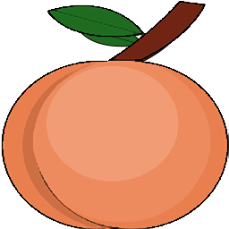
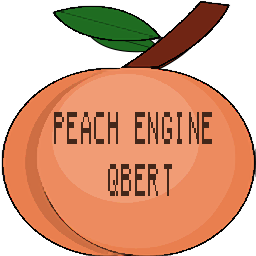

# Peach Engine
2D game engine for my programming 4 course. 
The engine is a static library and works with an application system through inheritance.

## Features
- Entity Component system (ECS). GameObject owns Components
- Scenemanager
- Simple 2D Colliders/Collision
- SDL mixer Audio ServiceLocator
- Command Systen to combine withh the inputManager
- Keyboard and Controller input
- Text and 2D Texture Components
- Simple BinaryReader and BinaryWriter
- Console logging system
- Dear ImGui
- Observer pattern
- SDL Rendering

##Sample Project - Qbert
Qbert Clone made for my exam. This game shows most of the game engine features.

## Built With
  - Microsoft Visual Studio 2019

## Authors
 - **Tristan Wauthier** - *code

## License
See LICENSE.MD

## Acknowledgments
  - Some code inspired by The Cherno's Game engine series : https://www.youtube.com/user/TheChernoProject

### Github repository link
https://github.com/Tris666w/PeachEngine
